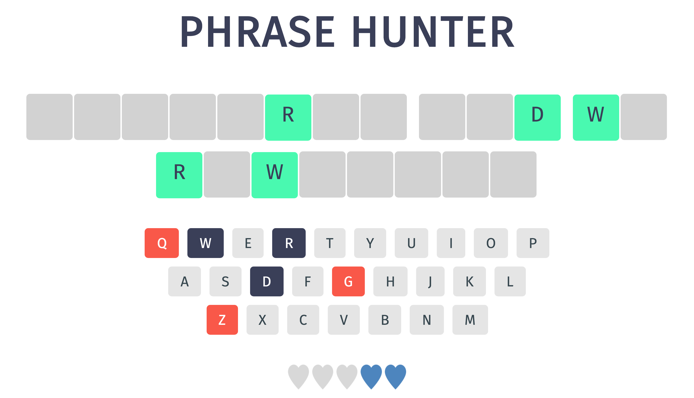

# OOP Game Show App

> Browser-based, word guessing game: "Phrase Hunter." Using JavaScript and Object-Oriented Programming to select a random, hidden phrase, which a player tries to guess, by clicking letters on an onscreen keyboard or physical computer keyboard

## Features

* OOP with JavaScript & jQuary
* Onscreen keyboard functionality
* Physical computer keyboard functionality

## Technologies

* JavaScript
* jQuery 3.4.0
* CSS
* HTML

## Demo

Active demo: [Game Show App](https://annes99.github.io/OOP-Game-Show-App/)

## Screenshot

## Status

Project is: _completed_

## Inspiration

Treehouse Techdegree: FSJS project 4 - OOP Game Show App

## CSS style changes

* .wrong - background: #f7a964 to #f95849
* h2 - add letter-spacing: 2px
* button - addtext-transform: uppercase
* .show - color: #3a3f58, background-color: #49f9b0, font-size: 30px, add text-transform: uppercase
* added new font 'Fira Sans'
  
## Contact

Created by [@Annes](https://twitter.com/annesCode)